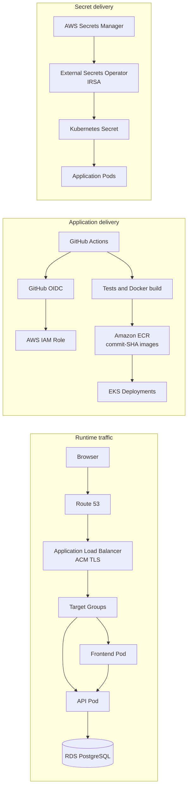

# AWS EKS Ticketing System

A cloud-native deployment project that provisions AWS infrastructure with Terraform and deploys a containerized .NET/SvelteKit application to Amazon EKS through GitHub Actions.

> The DevOps implementation currently lives on the [`devops` branch](https://github.com/dlrowww/ticketing-system-aws/tree/devops). Use this branch when reviewing the project.

## Key Highlights

- AWS infrastructure provisioned with Terraform and an encrypted S3 remote state backend
- Containerized .NET 8 API and SvelteKit frontend deployed to Amazon EKS
- GitHub Actions CI/CD using GitHub OIDC and short-lived AWS credentials
- Immutable commit-SHA Docker images stored in private Amazon ECR repositories
- Internet-facing ALB Ingress with optional Route 53 DNS and ACM-managed TLS
- Secrets synchronized from AWS Secrets Manager by External Secrets Operator using IRSA
- CloudWatch Container Insights, centralized container logs, EKS control-plane logs, and RDS logs
- Migration-first Kubernetes deployment followed by explicit rollout verification

## Architecture



The runtime is spread across two Availability Zones. Public subnets host internet-facing load-balancing resources, private subnets host EKS worker nodes, and isolated database subnets host RDS. The CI/CD and secret paths use separate IAM roles so that build, deployment, and controller permissions remain scoped to their responsibilities.

## Technology Stack

| Area | Technologies |
| --- | --- |
| Cloud | AWS VPC, EKS, ECR, RDS, ALB, Route 53, ACM, Secrets Manager, CloudWatch |
| Infrastructure as Code | Terraform, S3 remote state |
| Containers | Docker, Kubernetes, Helm |
| CI/CD | GitHub Actions, GitHub OIDC |
| Security | IAM, STS, IRSA, Security Groups, External Secrets Operator |
| Observability | CloudWatch, Container Insights, health probes |
| Application | .NET 8, SvelteKit, PostgreSQL |
| Automation | Bash, AWS CLI, kubectl, jq, envsubst |

## What I Implemented

The DevOps scope covers the AWS foundation, Kubernetes runtime, deployment automation, security boundaries, and operational validation. The application itself is a bilingual ticketing platform with a .NET API, SvelteKit frontend, and PostgreSQL database; the focus of this branch is making that workload repeatably testable, buildable, and deployable on AWS.

### AWS Infrastructure

- A VPC spans two Availability Zones with public, private, and database subnet tiers.
- EKS worker nodes run in private subnets; a NAT Gateway provides outbound access for the private tier.
- The internet-facing ALB is created from Kubernetes Ingress resources and uses ACM for TLS when a domain is configured.
- RDS PostgreSQL has no public endpoint and is placed in the database subnet group.
- Security Groups restrict PostgreSQL port `5432` access to the private application network.
- Terraform also provisions ECR repositories, Secrets Manager resources, IAM/IRSA roles, controllers, DNS, and observability components.

See [AWS application infrastructure](aws/APPLICATION_INFRASTRUCTURE.md) for resource-level details and prerequisites.

### Kubernetes Design

The repository contains:

- API and frontend `Deployment` resources with `RollingUpdate` strategies
- Internal `ClusterIP` Services and an AWS Load Balancer Controller `Ingress`
- Environment configuration through `ConfigMap` and `ExternalSecret`
- A one-shot database migration `Job` that must succeed before application rollout
- Startup, readiness, and liveness probes, including the API `/health` endpoint
- CPU and memory requests/limits plus restricted container security contexts
- Horizontal Pod Autoscaler and Pod Disruption Budget manifests for optional application

The shared deployment script applies configuration, services, secrets, the migration Job, and Deployments in dependency order. HPA and PDB manifests are included for review and deliberate application but are not automatically applied by that script. See the [Kubernetes deployment guide](k8s_deploy/README.md).

## CI/CD

Three path-scoped GitHub Actions workflows separate application, infrastructure, and Kubernetes configuration changes:

| Pipeline | Automatic checks on PRs and pushes to `main` | Manual deployment (`workflow_dispatch`) |
| --- | --- | --- |
| Application CI/CD | Restore, build, backend unit/integration tests, frontend lint/type-check/tests/build | Build commit-SHA images, push to ECR, migrate the database, deploy to EKS |
| Infrastructure | `terraform fmt`, offline initialization, `terraform validate` | State-aware Terraform `plan` or `apply` |
| Kubernetes configuration | Parse Kubernetes YAML and validate Bash syntax | Reuse the currently deployed immutable images and roll out manifest/script changes |

AWS-authenticated jobs assume dedicated IAM roles through GitHub OIDC; no long-lived AWS access key is required. Deployment images use the Git commit SHA as an immutable tag. Both deployment workflows call the same script, which waits for External Secrets, requires the migration Job to complete, updates the Deployments, and waits for `kubectl rollout status` to succeed.

Real infrastructure and application changes are intentionally manual. A pull request or push validates the relevant scope, but only `workflow_dispatch` can run Terraform against remote state or deploy to EKS. See [CI/CD documentation](CI_CD.md) for environment variables, role boundaries, and the first-deployment sequence.

## Security Decisions

- GitHub Actions uses OIDC-issued temporary AWS credentials instead of stored access keys.
- Infrastructure, application delivery, and Kubernetes-only delivery use separate workflow roles.
- IRSA isolates permissions for the AWS Load Balancer Controller, External Secrets Operator, ExternalDNS, and CloudWatch agent.
- Secret values are populated outside Terraform, so credentials are not stored in Terraform state.
- Interactive bootstrap scripts read secret values securely and do not place them in repository files or command-line arguments.
- RDS is not publicly accessible and accepts database traffic only through its Security Group rules.
- ACM manages the public TLS certificate, while ALB redirects HTTP traffic to HTTPS.
- Containers drop Linux capabilities and disable privilege escalation.

## Observability and Deployment Verification

The current implementation provides:

- All EKS control-plane log types enabled in CloudWatch
- Amazon CloudWatch Observability add-on with Container Insights
- Centralized collection of container `stdout` and `stderr`
- PostgreSQL and upgrade log exports from RDS
- Application health checks at `/health` and Kubernetes startup/readiness/liveness probes
- Migration Job logs emitted on success and failure
- Explicit API and frontend rollout-status checks in the deployment pipeline

This is logging and deployment verification, not a complete monitoring platform: operational dashboards and alerting are still planned.

## Project Structure

```text
aws/                 Terraform AWS infrastructure
k8s_deploy/          Kubernetes manifests
.github/workflows/   CI/CD workflows
devops_scripts/      Deployment and secret automation
backend/             .NET 8 API
frontend/            SvelteKit frontend
```

## Quick Start

Clone the branch containing the DevOps implementation and run the local Docker stack:

```bash
git clone --branch devops --single-branch https://github.com/dlrowww/ticketing-system-aws.git
cd ticketing-system-aws
docker compose -f docker-compose.local.yml up --build
```

For local setup options, ports, and environment variables, see [Local development](README.dev.md) and [Docker setup](README.docker.md).

To review the infrastructure without changing AWS resources:

```bash
terraform -chdir=aws fmt -check -recursive
terraform -chdir=aws init -backend=false
terraform -chdir=aws validate
```

To run the same lightweight Kubernetes and script validation used by CI:

```bash
ruby -rpsych -e 'Dir.glob("k8s_deploy/**/*.yaml").each { |f| Psych.parse_stream(File.read(f), filename: f) }'
bash -n devops_scripts/*.sh devops_scripts/lib/*.sh
```

AWS deployment requires an AWS account, the Terraform backend, GitHub Environments, OIDC roles, DNS settings if used, and initialized Secrets Manager values. Follow the [AWS infrastructure](aws/APPLICATION_INFRASTRUCTURE.md), [Kubernetes](k8s_deploy/README.md), [CI/CD](CI_CD.md), and [automation scripts](devops_scripts/README.md) guides rather than applying individual files out of order.

## Current Limitations

- Development-oriented AWS sizing
- A single NAT Gateway, creating an Availability Zone dependency for private-subnet egress
- Single-AZ RDS by default, with development defaults for backup retention and deletion protection
- No automated application rollback after a failed rollout
- No tested disaster-recovery procedure
- CloudWatch logging is configured, but alerting and operational dashboards are still planned
- The EKS public API endpoint is enabled by default and its allowed CIDR should be restricted for production
- The application currently uses the RDS master credential; a lower-privilege runtime database role is planned
- HPA and PDB manifests are available but are not part of the shared automated deployment path

These constraints are intentional and documented: the repository demonstrates a working development deployment and the controls around it, not a claim of full production readiness.
