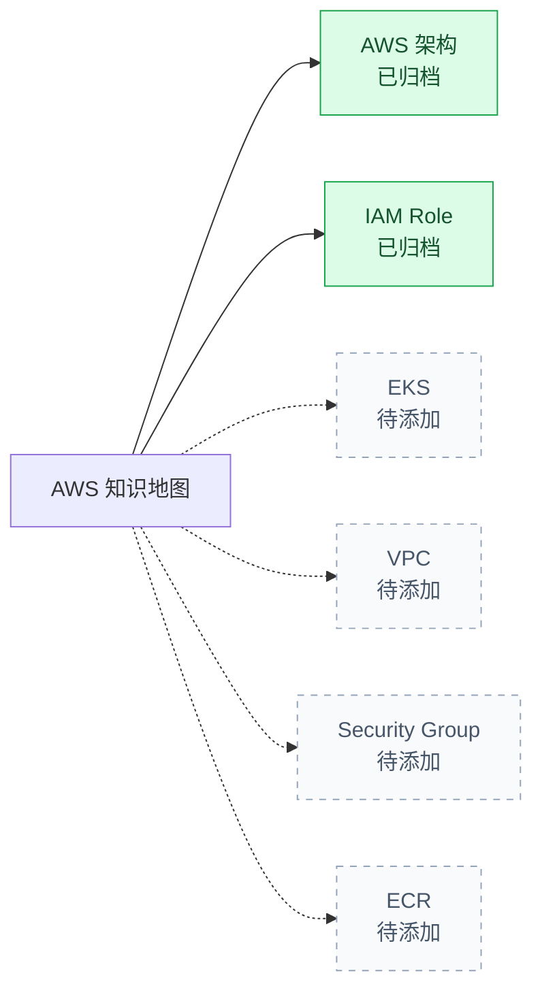

# AWS 知识地图

## 已归档

| 主题 | 一句话说明 | 笔记 |
|---|---|---|
| AWS 架构 | 从组件、位置、通信、权限、存储、入口和监控理解整体系统 | [进入 AWS 架构笔记](./architecture/README.md) |
| IAM Role | AWS 服务以什么身份、带着哪些权限调用 AWS API | [进入 IAM Role 笔记](./iam-role/README.md) |

## 后续可扩展的同级主题

要增加一个同级主题，只需创建 `aws/<主题>/README.md`，然后在上面的表格中增加入口。
