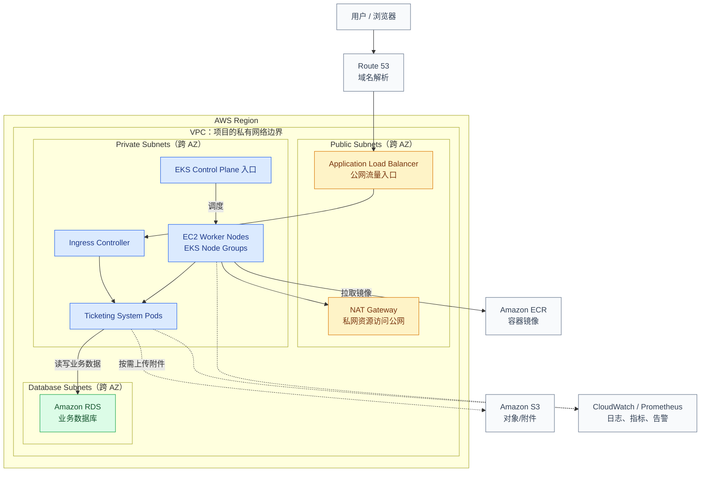
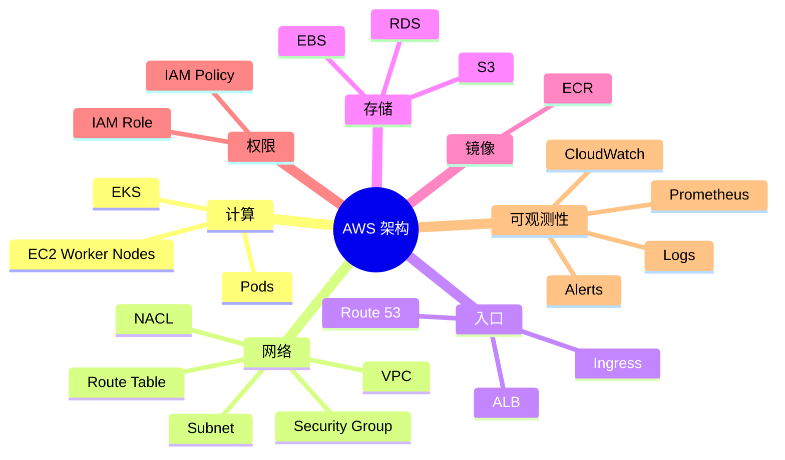
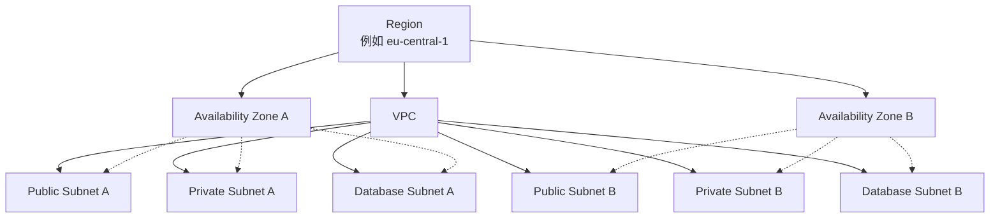
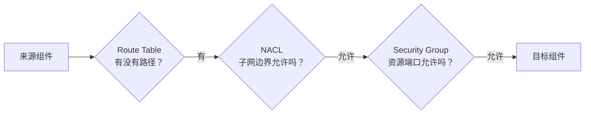
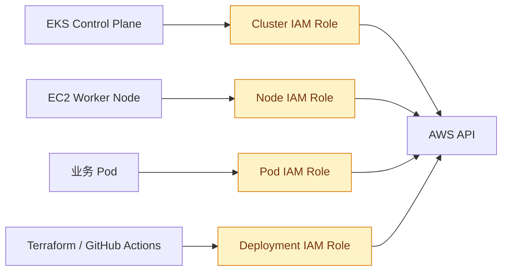
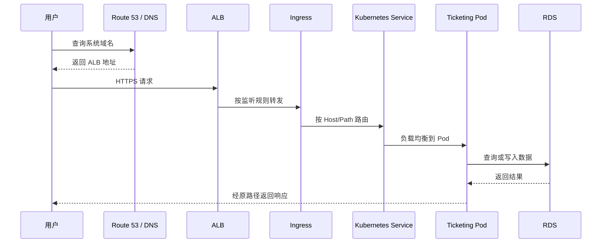
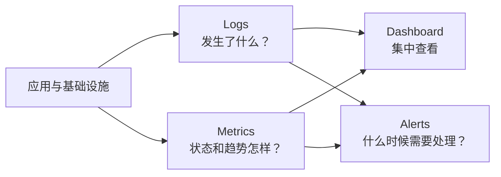

# AWS 架构可视化笔记

> **AWS 架构不只是服务器列表，而是：组件 + 放置位置 + 通信规则 + 身份权限 + 数据存储 + 流量入口 + 监控运维。**

返回：[AWS 知识地图](../README.md)

## 1. AWS 架构的基本组成

以当前 EKS 项目为例，可以先问四个核心问题：

1. 有哪些组件？
2. 组件放在哪里？
3. 组件之间怎么通信？
4. 每个组件分别有权做什么？

再补充三个运行问题：数据保存在哪里、用户怎样访问、系统如何监控。

| 要思考的问题 | AWS 中对应的内容 |
|---|---|
| 有哪些组件？ | EKS、EC2、RDS、ALB、ECR、S3 |
| 组件放在哪里？ | Region、Availability Zone、VPC、Subnet |
| 组件之间能否通信？ | Route Table、Security Group、NACL |
| 组件能否调用 AWS API？ | IAM Role、IAM Policy |
| 数据保存在哪里？ | RDS、EBS、S3 |
| 用户怎样访问？ | Route 53、ALB、Ingress |
| 系统如何监控？ | CloudWatch、Prometheus、日志与告警 |

## 2. 一张图看懂整体架构



这是一张概念图，用于理解各组件职责；最终部署以 Terraform 实际配置为准。

## 3. 组件：系统由什么组成？



### 计算组件

| 组件 | 通俗理解 | 在项目中的作用 |
|---|---|---|
| EKS | Kubernetes 托管服务 | 提供和管理集群控制面 |
| EC2 Worker Node | 真正干活的服务器 | 承载和运行 Pod |
| Pod | 应用运行单元 | 运行前端、后端等容器 |

### 数据与镜像

| 组件 | 适合保存什么 |
|---|---|
| RDS | 关系型业务数据，例如用户、工单、评论 |
| EBS | EC2 或 Kubernetes 有状态工作负载使用的块存储 |
| S3 | 文件、附件、备份等对象数据 |
| ECR | Docker/OCI 容器镜像 |

## 4. 位置：组件放在哪里？



最短记忆：

```text
Region  = 一个地理区域
AZ      = Region 内相互隔离的数据中心区域
VPC     = 你的 AWS 私有网络
Subnet  = VPC 中按用途和 AZ 划分的网段
```

通常把互联网入口放在 Public Subnet，把 Worker Node 放在 Private Subnet，把 RDS 放在 Database Subnet，并跨多个 AZ 提高可用性。

## 5. 通信：组件之间能不能互相到达？

网络通信需要分层判断：



| 控制项 | 通俗理解 | 主要作用层级 |
|---|---|---|
| Route Table | 道路指示牌 | 决定流量往哪里走 |
| NACL | 子网门卫 | 控制整个 Subnet 的进出流量 |
| Security Group | 资源门卫 | 控制 ALB、EC2、RDS 等资源的进出流量 |

IAM Role 不负责判断 HTTP 或数据库连接能不能通过。IAM Role 管的是 AWS API 权限，详见 [IAM 权限边界](../iam-role/access-boundaries.md)。

## 6. 权限：组件可以调用哪些 AWS API？



不同组件应该使用不同 Role，因为它们需要的权限不同。详细说明见 [IAM Role 可视化笔记](../iam-role/README.md)。

## 7. 用户请求怎样进入系统？



要让这条链路工作，DNS、监听器、Ingress 规则、Service selector、Pod 端口和各层 Security Group 都需要正确配置。

## 8. 系统如何被观察和维护？



| 类型 | 示例 |
|---|---|
| 日志 | 应用日志、ALB 访问日志、控制面日志 |
| 指标 | CPU、内存、请求量、错误率、延迟 |
| 告警 | Pod 不健康、5xx 增多、数据库空间不足 |
| 工具 | CloudWatch、Prometheus、Grafana 等 |

## 9. 一页速记

```text
AWS 架构
= 计算组件
+ 网络结构
+ 身份权限
+ 数据存储
+ 流量入口
+ 监控运维

组件是什么？       → EKS / EC2 / RDS / ALB / ECR / S3
组件放在哪里？     → Region / AZ / VPC / Subnet
组件能否通信？     → Route Table / NACL / Security Group
组件能调 AWS API？ → IAM Role / IAM Policy
数据放在哪里？     → RDS / EBS / S3
用户怎么访问？     → Route 53 / ALB / Ingress
系统怎么观察？     → Logs / Metrics / Alerts
```

## 10. 后续内容入口

内容增长后，可以继续在当前目录添加：

| 后续专题 | 建议文件名 | 状态 |
|---|---|---|
| Region、AZ 与高可用 | `region-and-az.md` | 待添加 |
| VPC 与三类 Subnet | `vpc-and-subnets.md` | 待添加 |
| 用户请求完整链路 | `request-flow.md` | 待添加 |
| 数据与备份架构 | `data-and-backup.md` | 待添加 |
| 日志、指标与告警 | `observability.md` | 待添加 |
