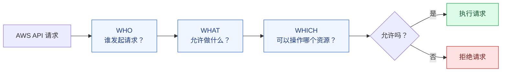
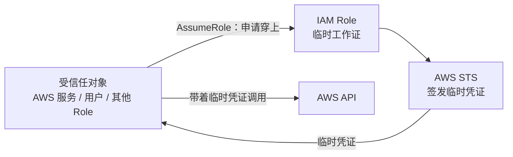
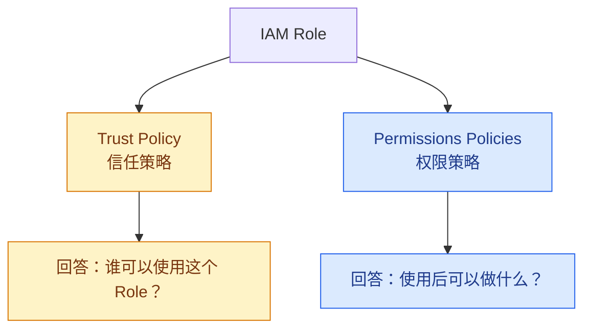
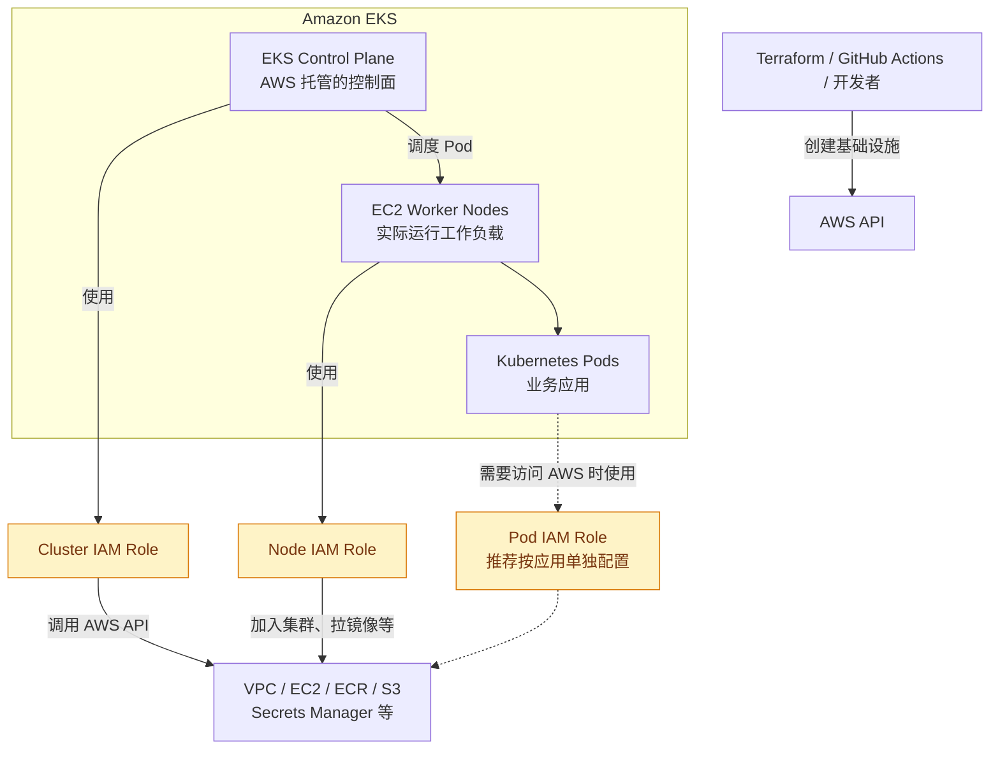
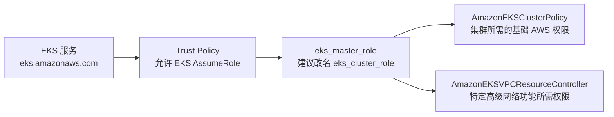
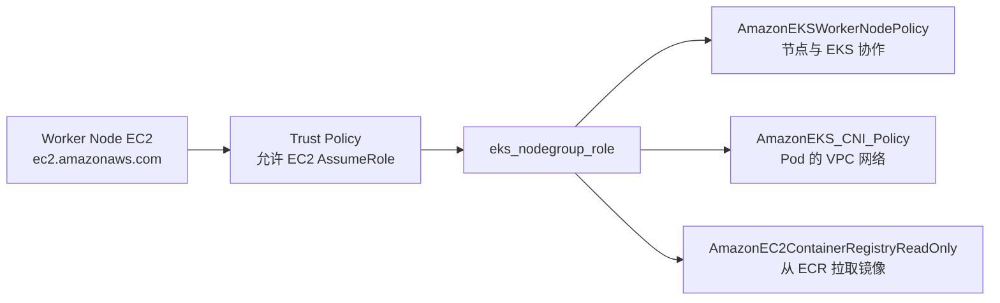
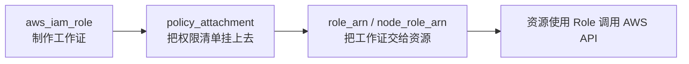

# IAM Role 可视化笔记

> **一句话记忆：IAM Role 是一张可以临时穿上的 AWS“工作证”。它规定谁能穿，以及穿上以后能做什么。**

本文结合项目中的以下 Terraform 配置：

- [`t4-03-iamrole-for-eks-cluster.tf`](../../../aws/t4-03-iamrole-for-eks-cluster.tf)
- [`t4-04-iamrole-for-eks-nodegroup.tf`](../../../aws/t4-04-iamrole-for-eks-nodegroup.tf)

## 1. IAM 解决什么问题？

AWS 中的 EKS、EC2、ECR、S3 等资源经常需要互相调用。AWS 收到一个 API 请求时，需要判断：



可以把 IAM 概括成：

```text
WHO can do WHAT on WHICH resource
谁      能做什么      对哪个资源
```

IAM Role 不负责创建服务器或连接网络。它只负责告诉 AWS：某个服务、服务器、Pod 或人，能够以什么身份执行哪些 AWS API 操作。

## 2. IAM Role 到底是什么？

把 AWS 想象成一家公司，IAM Role 就是不同岗位的临时工作证：

| 工作证 | 谁使用 | 可能允许的工作 |
|---|---|---|
| EKS Cluster Role | EKS 服务 | 管理集群相关的 AWS 资源 |
| Node Role | Node Group 中的 EC2 | 加入集群、拉取镜像、配置网络 |
| Pod Role | 指定的 Pod 应用 | 读取 S3、Secrets Manager 等 |
| Deployment Role | Terraform 或 CI/CD | 创建、更新基础设施 |

Role 不是用户账号、密码、Access Key 或网络规则。受信任对象使用 Role 时，AWS STS 会提供有期限的临时凭证。



## 3. 一个 Role 的两个核心部分



### 3.1 Trust Policy：谁能穿这件制服？

Node Role 中的代码：

```hcl
assume_role_policy = jsonencode({
  Statement = [{
    Action = "sts:AssumeRole"
    Effect = "Allow"
    Principal = {
      Service = "ec2.amazonaws.com"
    }
  }]
  Version = "2012-10-17"
})
```

通俗翻译：

```text
Principal = ec2.amazonaws.com  → EC2 可以使用这张工作证
Action    = sts:AssumeRole     → EC2 可以临时承担这个角色
Effect    = Allow              → 允许上述行为
```

其中 `Principal` 是“谁”，`sts:AssumeRole` 是“允许它临时穿上这件制服”。

### 3.2 Permissions Policy：穿上后能做什么？

```hcl
resource "aws_iam_role_policy_attachment" "eks-AmazonEKSWorkerNodePolicy" {
  policy_arn = "arn:aws:iam::aws:policy/AmazonEKSWorkerNodePolicy"
  role       = aws_iam_role.eks_nodegroup_role.name
}
```

通俗翻译：把 AWS 准备好的 `AmazonEKSWorkerNodePolicy` 权限清单，挂到 `eks_nodegroup_role` 这张工作证上。

```text
Role       = 员工的工作证
Policy     = 允许事项清单
Attachment = 把清单挂到工作证上
```

两个部分缺一不可：

- 有人可以拿工作证，但工作证没有权限：拿到也做不了事。
- 工作证权限很大，但没有人被允许拿：仍然没有人能使用。

## 4. IAM Role 在 EKS 架构中的位置



这里至少有三种身份，它们不应该全部共用一个 Role：

1. EKS Control Plane 身份。
2. EC2 Worker Node 身份。
3. Pod 应用身份。

分开是为了遵守最小权限原则：每个身份只得到完成自己工作必需的权限。

## 5. 项目中的两个 IAM Role 有什么区别？

| 对比项 | Cluster IAM Role | Node IAM Role |
|---|---|---|
| Terraform 名称 | `eks_master_role` | `eks_nodegroup_role` |
| 谁使用 | `eks.amazonaws.com` | `ec2.amazonaws.com` |
| 对应对象 | EKS Control Plane | Node Group 里的 EC2 |
| 主要目的 | 让 EKS 管理集群相关 AWS 资源 | 让节点加入集群、配置网络、拉取镜像 |
| 连接到资源的字段 | `aws_eks_cluster.role_arn` | `aws_eks_node_group.node_role_arn` |

`eks_master_role` 只是项目中的名字。更清楚的名字是 `eks_cluster_role`，因为现代 Kubernetes 通常称为 Control Plane，而不是 Master。

### 5.1 Cluster IAM Role（t4-03）



- `AmazonEKSClusterPolicy`：EKS 集群使用的基础 AWS 托管权限策略。
- `AmazonEKSVPCResourceController`：与部分高级网络能力有关，例如 Security Groups for Pods；不是理解基础 EKS Role 时必须背下来的内容。

### 5.2 Node IAM Role（t4-04）



公共和私有 Node Group 可以共用这个 Node Role。如果两组节点以后需要不同权限，再拆分为两个 Role。

## 6. 为什么配置 Cluster 和 Node Group 时还要写 Role？

创建 Role 和把 Role 交给资源，是两件不同的事。



Cluster 需要这样关联：

```hcl
resource "aws_eks_cluster" "eks_cluster" {
  name     = local.eks_cluster_name
  role_arn = aws_iam_role.eks_master_role.arn
}
```

Node Group 需要这样关联：

```hcl
resource "aws_eks_node_group" "eks_ng_public" {
  cluster_name  = aws_eks_cluster.eks_cluster.name
  node_role_arn = aws_iam_role.eks_nodegroup_role.arn
}
```

项目确实在 t4-03 中单独创建了 Cluster IAM Role。但当前 `t4-06-eks-cluster.tf` 是空文件，所以还没有通过 `role_arn` 真正把它交给 EKS Cluster；Node Group 文件目前也是同样情况。

## 7. 最容易混淆的概念

| 概念 | 它回答的问题 | 不是做什么的 |
|---|---|---|
| Trust Policy | 谁能使用这个 Role？ | 不定义使用后能访问哪些资源 |
| Permissions Policy | 使用 Role 后能做什么？ | 不决定谁能使用 Role |
| Role ARN | 这张工作证的唯一编号是什么？ | 它本身不是权限清单 |
| STS AssumeRole | 如何临时穿上这件工作服？ | 不是创建一个长期用户 |
| Security Group | 哪些网络流量能进出？ | 不控制 AWS API 权限 |
| Kubernetes RBAC | 谁能操作 Kubernetes API？ | 不直接授予 AWS API 权限 |

## 8. 一页速记

```text
IAM Role = 可被临时使用的 AWS 身份 + 权限

Trust Policy       → 谁可以穿这件制服？
Permissions Policy → 穿上以后能做什么？
Role ARN           → 这件制服的唯一编号
STS AssumeRole     → 临时穿上这件制服

EKS Cluster Role   → 给 EKS Control Plane 使用
Node Role          → 给 Node Group 中的 EC2 使用
Pod Role           → 给指定 Pod 应用使用

只创建 Role 不等于资源已经使用它：
Cluster 通过 role_arn 关联
Node Group 通过 node_role_arn 关联
```

## 9. 后续内容入口

本文件保留为 IAM Role 的总览。详细内容拆分到当前目录，便于继续扩展：

| 专题笔记 | 文件 | 状态 |
|---|---|---|
| Node Role、三个 Policy 与临时凭证 | [node-role.md](./node-role.md) | 已归档 |
| Terraform 身份、PassRole 与 AssumeRole | [terraform-passrole.md](./terraform-passrole.md) | 已归档 |
| IAM/网络/RBAC 边界、Pod Role 与判断方法 | [access-boundaries.md](./access-boundaries.md) | 已归档 |
| Pod 如何安全访问 AWS（IRSA / Pod Identity） | `pod-role.md` | 可继续深入 |
| 自定义 Policy 与最小权限 | `permissions-policy.md` | 待添加 |
| AssumeRole 与 STS 临时凭证 | `sts-assume-role.md` | 待添加 |
| IAM Role 常见排错方法 | `troubleshooting.md` | 待添加 |

添加文件后，在这里补上链接即可，不需要重写整篇总览。
