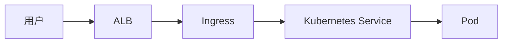
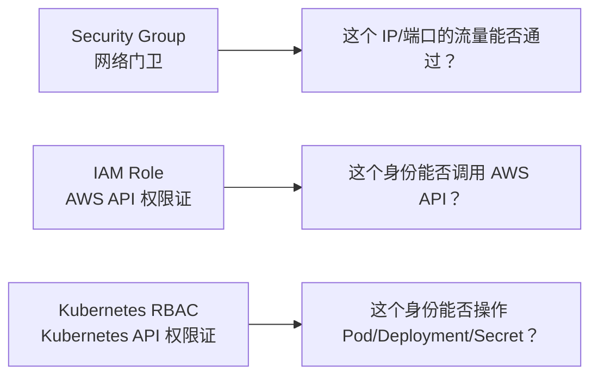
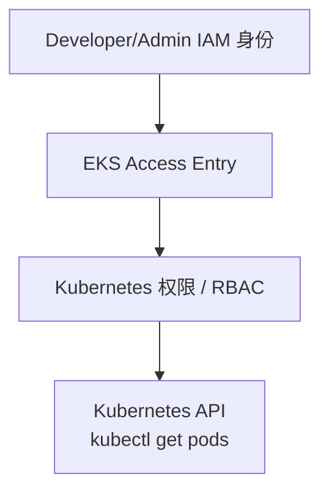
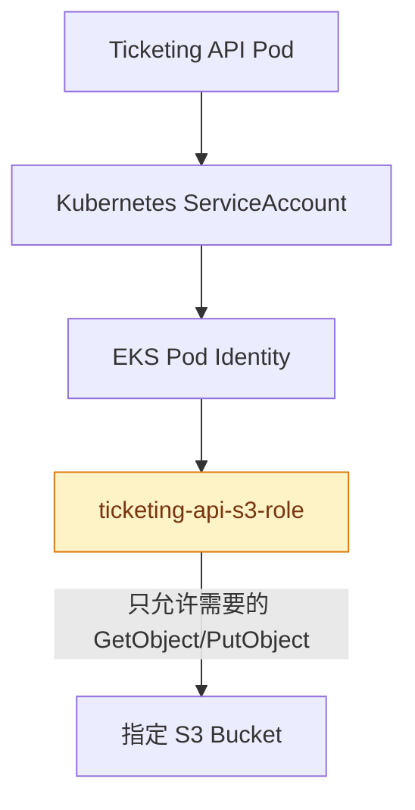
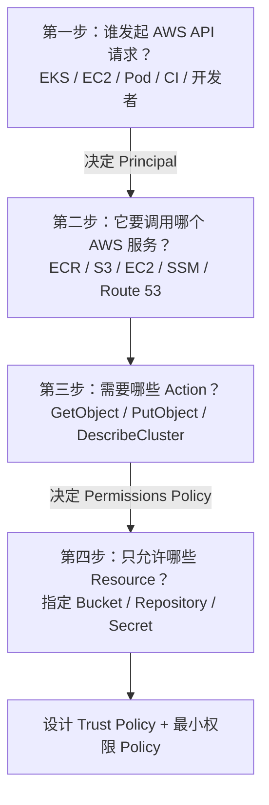

# IAM 权限边界、Pod Role 与判断方法

> **IAM Role 管 AWS API 权限；Security Group 管网络流量；Kubernetes RBAC 管 Kubernetes API 权限。**

返回：[IAM Role 总览](./README.md)

## 1. IAM Role 不负责网络流量

用户访问 Ticketing System 的流量可能是：



这条路径主要由以下内容控制：

- Security Group
- NACL
- Route Table
- Ingress
- Kubernetes NetworkPolicy
- Kubernetes Service

IAM Role 通常不决定 HTTP 请求能否从 ALB 到达 Pod。它决定某个身份能否调用 AWS API，例如：

```text
ec2:CreateNetworkInterface
ecr:GetDownloadUrlForLayer
s3:GetObject
eks:DescribeCluster
```



## 2. IAM Role 和 Kubernetes Role 不是同一个东西

| 类型 | 管理范围 | 例子 |
|---|---|---|
| IAM Role | AWS 资源和 AWS API | 读取 S3、从 ECR 拉镜像 |
| Kubernetes Role | 单个 Namespace 内的 Kubernetes 对象 | 查看 Pod、创建 Deployment |
| Kubernetes ClusterRole | 整个集群范围的 Kubernetes 对象 | 查看所有 Namespace 的 Node |

开发者执行 `kubectl get pods` 时，通常不是在使用 Cluster IAM Role 或 Node IAM Role。典型访问链路是：



## 3. Pod 需要访问 S3 时用哪个 Role？

不推荐给整个 Node Role 增加 `S3FullAccess`，因为同一 Node 上的其他 Pod 也可能接触到 Node 的凭证。更合理的方式是让业务 Pod 使用独立、最小权限的 Role。



实际 EKS 项目中，组件多、Role 多是正常现象：

| 组件 | 独立 Role 可能负责的权限 |
|---|---|
| `ticketing-api-role` | 读取 Secret、上传指定 S3 Bucket |
| `aws-load-balancer-controller-role` | 管理 ALB |
| `ebs-csi-controller-role` | 创建和挂载 EBS |
| `external-dns-role` | 修改 Route 53 |
| `aws-node-cni-role` | 管理 ENI 和 IP |

这不是为了增加复杂度，而是为了避免一个组件拥有整个系统的全部权限。

AWS 目前为 EKS 工作负载提供 EKS Pod Identity 和 IRSA 两种细粒度授权方式，并建议条件允许时优先考虑 EKS Pod Identity。

## 4. 怎样判断一个组件需要什么 IAM Role？



### 第一步：谁在发起请求？

它决定 Trust Policy 中的 `Principal`：EKS 服务、EC2、Pod、GitHub Actions、开发人员还是 Lambda？

### 第二步：调用什么 AWS 服务？

例如 ECR、S3、EKS、EC2、SSM、Secrets Manager、Route 53 或 CloudWatch。

### 第三步：具体需要什么 Action？

避免笼统地给 `FullAccess`，先列出实际动作：

```text
s3:GetObject
s3:PutObject
ecr:GetDownloadUrlForLayer
eks:DescribeCluster
ec2:CreateNetworkInterface
```

### 第四步：只允许哪些 Resource？

在服务 API 支持资源级授权时，尽量指定具体 ARN，而不是直接使用：

```json
"Resource": "*"
```

目标是只允许访问指定的 ECR Repository、S3 Bucket 或 Secrets Manager Secret。某些 API 本身只支持 `*` 时，再保留通配符。

## 5. 官方资料

- [Grant Kubernetes workloads access using ServiceAccounts](https://docs.aws.amazon.com/eks/latest/userguide/service-accounts.html)
- [Learn how EKS Pod Identity grants pods access](https://docs.aws.amazon.com/eks/latest/userguide/pod-identities.html)
- [Learn how access control works in Amazon EKS](https://docs.aws.amazon.com/eks/latest/userguide/cluster-auth.html)
