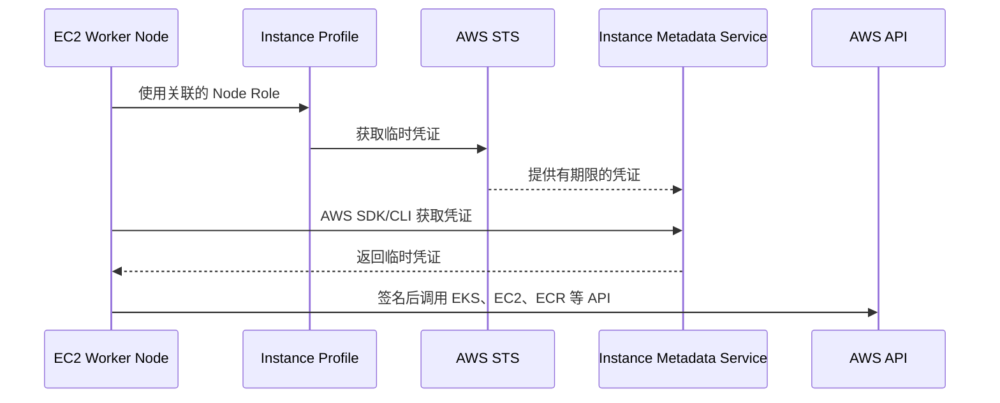
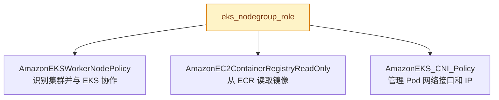
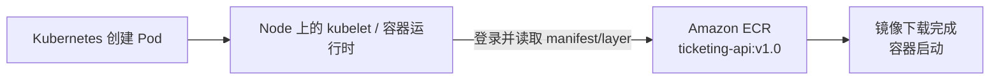
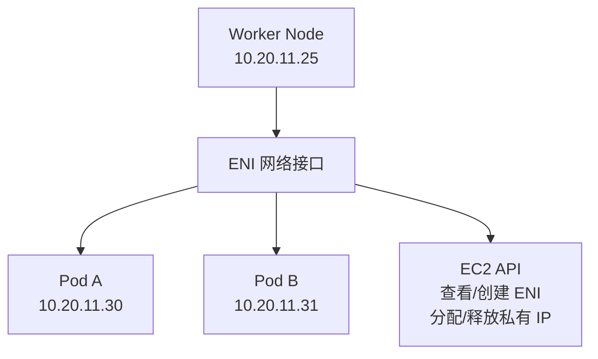
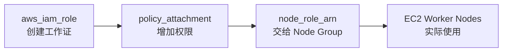

# EKS Node Group IAM Role

> **Node Role 是交给 EC2 Worker Node 的工作证，不是交给 EKS Control Plane 的工作证。**

返回：[IAM Role 总览](./README.md)

## 1. 第二张工作证

项目代码位于 [`t4-04-iamrole-for-eks-nodegroup.tf`](../../../aws/t4-04-iamrole-for-eks-nodegroup.tf)：

```hcl
resource "aws_iam_role" "eks_nodegroup_role" {
  name = "${local.name}-eks-nodegroup-role"

  assume_role_policy = jsonencode({
    Statement = [{
      Action = "sts:AssumeRole"
      Effect = "Allow"
      Principal = {
        Service = "ec2.amazonaws.com"
      }
    }]
    Version = "2012-10-17"
  })
}
```

最关键的区别是 `Principal`：

| Role | Principal | 实际使用者 |
|---|---|---|
| Cluster Role | `eks.amazonaws.com` | Amazon EKS 服务 |
| Node Role | `ec2.amazonaws.com` | EC2 Worker Node |

## 2. Worker Node 为什么需要 IAM Role？

Worker Node 本质上是 EC2 实例。启动后，它可能需要：

1. 获取 EKS 集群信息并加入集群。
2. 获取必要的 EC2/VPC 信息。
3. 从 ECR 拉取容器镜像。
4. 为 Pod 配置网络接口和 IP。
5. 在额外授权后使用 SSM 或发送日志、监控数据。

这些属于 AWS API 操作，所以需要 AWS 身份和权限。



因此不应把长期静态密钥写入 Worker Node：

```text
AWS_ACCESS_KEY_ID
AWS_SECRET_ACCESS_KEY
```

Instance Profile 可以理解为“把 IAM Role 安装到 EC2 上的外壳”。Node 上的软件通过标准凭证链取得并自动轮换临时凭证。

## 3. 项目中的三个 Policy



### 3.1 AmazonEKSWorkerNodePolicy

```hcl
policy_arn = "arn:aws:iam::aws:policy/AmazonEKSWorkerNodePolicy"
```

它给 `kubelet` 等节点组件提供所需权限，例如获取 EKS 集群及必要的 EC2 信息。通俗理解：

> 让这台普通 EC2 能以 EKS Worker Node 的身份工作。

### 3.2 ECR Policy

项目当前使用：

```hcl
policy_arn = "arn:aws:iam::aws:policy/AmazonEC2ContainerRegistryReadOnly"
```

典型过程：



没有相应权限时，常见现象包括 `ImagePullBackOff`、`AccessDenied` 或 `no basic auth credentials`。

AWS 当前 Node Role 指南列出的更窄托管策略是 `AmazonEC2ContainerRegistryPullOnly`。项目里的 `ReadOnly` 通常也能完成拉取，但权限范围更大；以后整理最小权限时可以考虑替换。

### 3.3 AmazonEKS_CNI_Policy

CNI 是 Container Network Interface。AWS VPC CNI 会为 Pod 分配能在 VPC 内通信的 IP，并管理 ENI：



项目为了简单，把 `AmazonEKS_CNI_Policy` 直接挂在 Node Role 上，这样可以工作。更符合最小权限的做法，是使用 EKS Pod Identity 或 IRSA 给 `aws-node` ServiceAccount 单独配置 Role，避免 Node 上其他程序继承这组较强的网络权限。

## 4. Node Role 什么时候真正被使用？

仅创建 `aws_iam_role` 和 Policy Attachment，还没有把工作证交给 Node Group。真正关联发生在：

```hcl
resource "aws_eks_node_group" "private_nodes" {
  cluster_name  = aws_eks_cluster.eks_cluster.name
  node_role_arn = aws_iam_role.eks_nodegroup_role.arn
}
```



项目当前 Node Group 文件还是空的，因此 `eks_nodegroup_role` 已被定义，但尚未通过 `node_role_arn` 交给实际 Node Group。

## 5. 官方资料

- [Amazon EKS node IAM role](https://docs.aws.amazon.com/eks/latest/userguide/create-node-role.html)
- [IAM roles for Amazon EKS add-ons](https://docs.aws.amazon.com/eks/latest/userguide/add-ons-iam.html)

