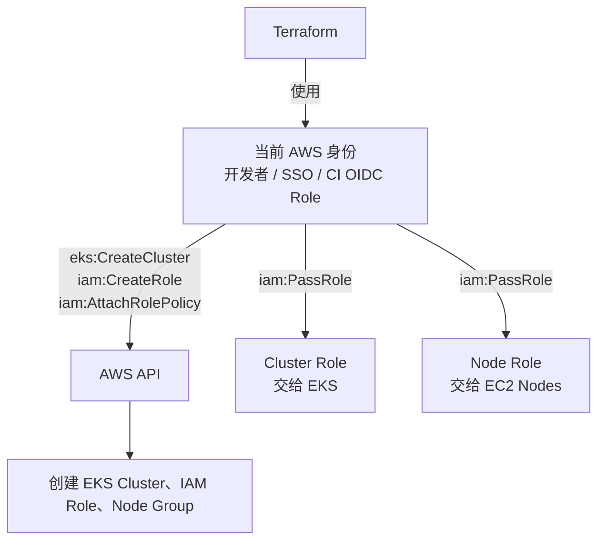
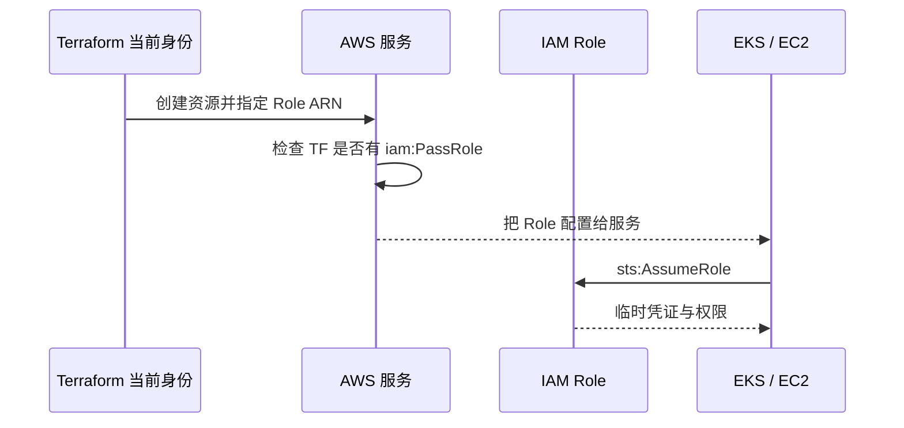

# Terraform 身份、PassRole 与 AssumeRole

> **Terraform 是创建资源的人；Cluster Role 和 Node Role 是资源创建后使用的工作证。两者不是同一个身份。**

返回：[IAM Role 总览](./README.md)

## 1. Terraform 自己使用哪个身份？

执行：

```bash
terraform apply
```

Terraform 会使用当前环境提供的 AWS 身份，例如：

- AWS CLI / IAM Identity Center 登录后的身份。
- 当前终端已经承担的 IAM Role。
- EC2 或其他运行环境的 Role。
- GitHub Actions 通过 OIDC 承担的部署 Role。

它不会自动变成 `eks_master_role` 或 `eks_nodegroup_role`。



## 2. iam:PassRole 是什么？

通俗理解：

> 允许当前身份把一张工作证交给指定的 AWS 服务使用。

Terraform 创建 EKS Cluster 时写入：

```hcl
role_arn = aws_iam_role.eks_master_role.arn
```

创建 Node Group 时写入：

```hcl
node_role_arn = aws_iam_role.eks_nodegroup_role.arn
```

执行 Terraform 的身份通常需要对相应 Role 拥有 `iam:PassRole`。否则可能有权创建 EKS，却没有权把指定 Role 交给 EKS 或 EC2。

## 3. PassRole 与 AssumeRole 的区别

| 动作 | 通俗解释 | 谁执行 |
|---|---|---|
| `iam:PassRole` | 我允许把这张工作证交给某个服务 | Terraform 当前身份/创建者 |
| `sts:AssumeRole` | 我现在临时穿上这张工作证 | Trust Policy 允许的 Principal |



最短记忆：

```text
PassRole   = 把制服交给别人
AssumeRole = 自己临时穿上制服
```

## 4. 三个阶段不要混淆

```text
aws_iam_role
└── 创建工作证

aws_iam_role_policy_attachment
└── 给工作证增加权限

role_arn / node_role_arn
└── 把工作证交给对应 AWS 服务
```

